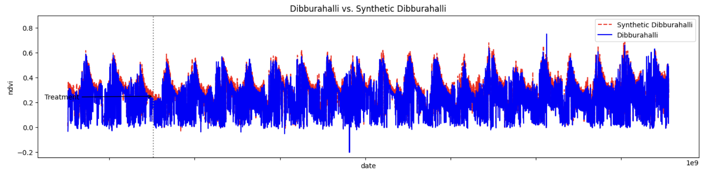
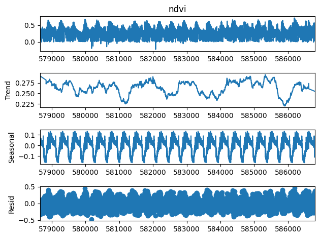
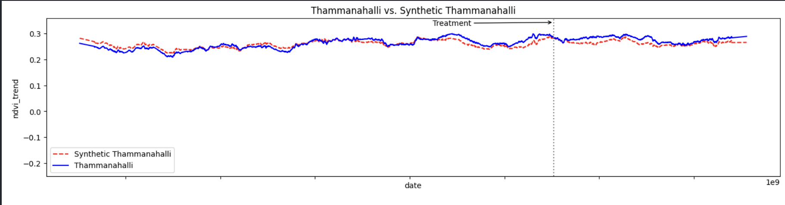

# Application of the Synthetic Control Package
[This](https://github.com/OscarEngelbrektson/SyntheticControlMethods) package was used to determine the effects if any of the construction of NREGA assets on the NDVI (Normalized Difference Vegetation Index) of treated panchayats. 

## Setup 

Coviariate and outcome data is required to train the synthetic control model. The `combined-remote-data-long-form.csv` file can be downloaded from [here](https://drive.google.com/file/d/1jt0di54slcEhZg3akn5Ma1NDk_Zjpzwl/view?usp=share_link) and needs to be placed in the current directory. 

The other data file needed is a pickle file extracted from the previous Synthetic Control notebook. The `worksl3.pickle` file contains the Pandas dataframe containing details of the assets built as part of the NREGA initiative. It contains relevant data like the date the building of the asset was started which is useful for the synthetic control process. 

Once the data files are set up, the notebook can be run in an appropriate Python environment.

## Preprocessing
The data is processed according to the requirements of the package. A brief about the requirements given for the usage of the package are given below:
- All the values (except the identifier: panchayat which is categorical) are numerical. There can be only one identifier column in the dataframe. 
- The dataset is sorted by the identifier (panchayat) and then time unit (date).
- Analysis must be done using one treated unit and multiple control units. 
- There should be no missing values for the outcome (NDVI). However, the package allows missing values for covariates, but, our data does not have any values missing. 

Apart from the requirements given, the Pandas data column is converted to a Unix timestamp to make sorting and analyzing based on time easier. 

## Removal of Seasonal and Residual Component

Applying the synthetic control method on the data directly after preprocessing gives the following results for a panchayat:

As can be seen from the figure above, the NDVI follows a periodic function which makes any trend (increasing or decreasing) less apparent. We can fix this issue by decomposing the data into three components:
- **Trend Component**: This component shows us the general trend of the data, whether it is increasing, decreasing or remaining constant over the given time period. 
- **Seasonal Component**: This component indicates any repeating pattern in the data, for example the vegetation index would be expected to increase after rainfall and then decrease afterwards. 
- **Residual Component**: This is the randomness component of the data left after removing the trend and seasonal component. It is determined by external factors that cannot be predicted or analyzed effectively and hence are considered random.

Shown below is the result of decomposing the NDVI data for the panchayat: **Dhulappalli** into the above components. As can be seen from the figure, it is much easier to make inferences about any trends in the NDVI that may have been altered by the construction of an asset in the panchayat. 

The data is decomposed into the above components using the `seasonal_decompose` function from the `statsmodels` package. The additive method is used to decompose the data and the time interval for seasonality is given as 365 time units (days).

## Usage of Covariate Data

Covariate features are features that are useful during analysis but are not of direct interest to us. Alongside the outcome variable, several other covariate features are used to more effectively train the synthetic control model. Some of these features are:
- **Surface Net Solar Radiation**: It is the amount of solar radiation reaching the Earth's surface minus the amount of solar radiation reflected from the Earth's surface assuming cloudless conditions. 
- **Total Precipitation**: It is the total amount of rain or snow that falls to the Earth's surface. 
- **U-component of wind**: Is is the speed of the wind along the east-west direction.
- **V-component of wind**: Is is the speed of the wind along the north-south direction.
- **2 meter Temperature**: It is the temperature measured in the shade at a height of 2 meters. It gives us a general idea of the current and future temperature at a particular place on the Earth's surface. 

## Results
After preprocessing and removing the seasonal and residual components of the NDVI data, the Synthetic control model is applied for some panchayats where treatment has taken place. The date of treatment for that panchayat is taken from the `worksl3` dataframe. 

A graph showing the actual and synthetic NDVI trend before and after treatment is shown below. 

## Future work

- Currently, the seasonal and residual component was removed only for the outcome variable (NDVI), however, perhaps the model would benifit from doing so for covariate data as well as it would make training easier. 

- We can also conduct several placebo tests where the treatment of interest is reassigned to a time other than when the treatment was done or to a panchayat other than the one treated. 

- Despite removing the residual component, the trend data seems quite random, perhaps due to the large amount of data points (over a large time interval). It would probably be better to take an average of the outcome and covariate data over a larger time interval (a week or a month) to make the trend data easier for training.